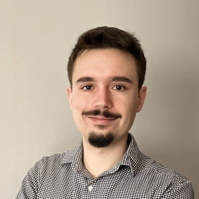
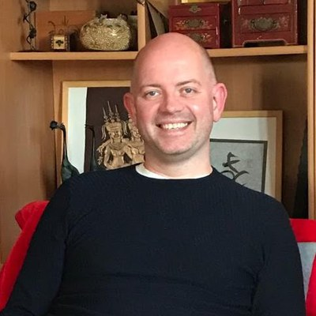
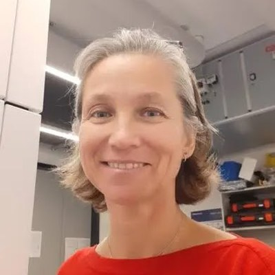
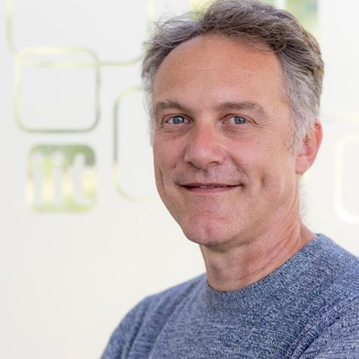
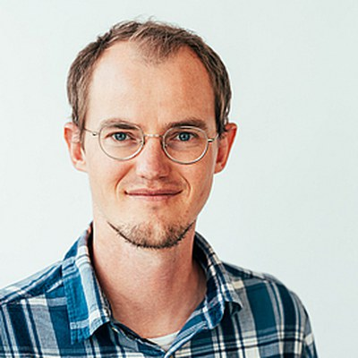
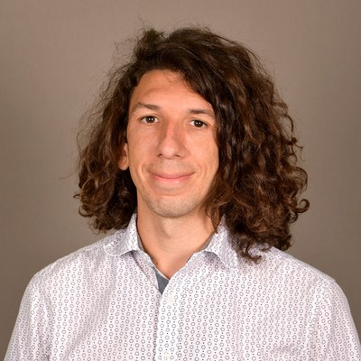
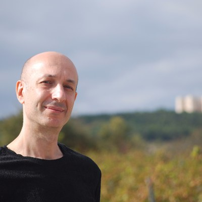

# Instructors

Questions about the school can be sent to [IUCrECS2026@gmail.com](mailto:IUCrECS2026@gmail.com).

## Organizers

::::{div}
:class: ecs-people

:::{div}
:class: ecs-person

**[Sergi Plana Ruiz](https://github.com/sergiPlana/TEMEDtools)**
*Universitat Autònoma de Barcelona*
:::

:::{div}
:class: ecs-person

**[Andrew Stewart](https://profiles.ucl.ac.uk/87729-andrew-stewart)**
*Department of Chemistry, University College London*
:::

::::

## Scientific committee

The scientific committee of this school is composed of the following well-established researchers in the field of electron crystallography.

::::{div}
:class: ecs-people

:::{div}
:class: ecs-person

**[Tatiana E. Gorelik](https://scholar.google.com/citations?user=9MMZYT8AAAAJ&hl=en)**
*Forschungszentrum Jülich*
:::

:::{div}
:class: ecs-person

**[Mauro Gemmi](https://www.iit.it/people-details/-/people/mauro-gemmi)**
*Istituto Italiano di Tecnologia*
:::

:::{div}
:class: ecs-person

**[Paul Klar](https://www.uni-bremen.de/en/university/academic-career/senior-researcher-senior-lecturer/a-portrait-our-academics-introduce-themselves/details/paul-klar)**
*Universität Bremen*
:::

::::

## Speakers

::::{div}
:class: ecs-people

:::{div}
:class: ecs-person

**[Lukáš Palatinus](https://p4f.fzu.cz/fzu_supervisor/dr-rer-nat-lukas-palatinus/)**
*Institute of Physics of the Czech Academy of Sciences*
:::

:::{div}
:class: ecs-person

**[Colin Ophus](https://colab.stanford.edu)**
*Materials Science and Engineering, Stanford University*
:::

:::{div}
:class: ecs-person

**[Brent Nannenga](https://search.asu.edu/profile/339761)**
*School for Engineering of Matter, Transport and Energy, Arizona State University*
:::

:::{div}
:class: ecs-person

**[Marcus Gallagher-Jones](https://www.rfi.ac.uk/our-people/marcus-gallagher-jones/)**
*The Rosalind Franklin Institute*
:::

:::{div}
:class: ecs-person

**[Tatiana E. Gorelik](https://scholar.google.com/citations?user=9MMZYT8AAAAJ&hl=en)**
*Ernst Ruska Centre, Forschungszentrum Jülich*
:::

:::{div}
:class: ecs-person

**[Sergi Plana Ruiz](https://github.com/sergiPlana/TEMEDtools)**
*Universitat Autònoma de Barcelona*
:::

:::{div}
:class: ecs-person

**[Andrew Stewart](https://profiles.ucl.ac.uk/87729-andrew-stewart)**
*Department of Chemistry, University College London*
:::

:::{div}
:class: ecs-person

**[Corrado Cuocci](https://www.ic.cnr.it/en/staff/cuocci-corrado-2/)**
*Institute of Crystallography — CNR*
:::

:::{div}
:class: ecs-person

**[Louisa Meshi](https://cris.bgu.ac.il/en/persons/louisa-meshi/)**
*Ben Gurion University of the Negev*
:::

::::

## Sponsor speakers

- **G. Mangan** — Quantum Detectors
- **M. Veron** — NanoMEGAS

See the [programme](./agenda.md) for which blocks each speaker leads, and the [sponsors page](./sponsors.md) for more about the sponsors.
