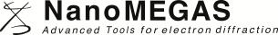
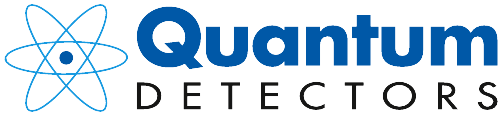
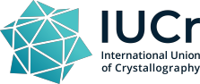
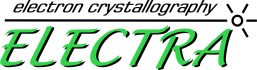

# Sponsors

The 2026 Electron Crystallography School is made possible by the support of our sponsors.

:::{div}
:class: ecs-logo-grid

:::

## Sponsor talks

Two sponsors give talks on the afternoon of [Day 3](./agenda.md#monday-day3):

| Time | Talk | Speaker |
| --- | --- | --- |
| 14:00 – 14:30 | Quantum Detectors | G. Mangan |
| 14:30 – 15:00 | NanoMEGAS | M. Veron |

## Organizing bodies

The school is an official satellite school of the International Union of Crystallography, organized with the European Crystallographic Association and the ELECTRA electron crystallography network.

:::{div}
:class: ecs-logo-grid

:::
